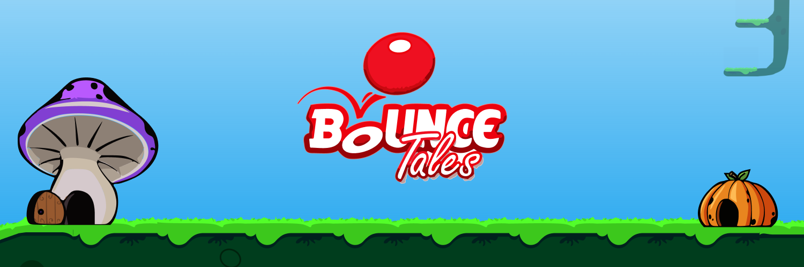

# Bounce Tales Clone in JavaScript

## Introduction

I am a big fan of old Nokia games, and Bounce Tales is one of my all-time favorites. I decided to create this clone in JavaScript to relive some of my childhood nostalgia.

## Features

This clone will include most of the features of the original Bounce Tales game, such as:

- A variety of different levels
- Different types of obstacles
- Power-ups
- Bosses
- Multiple difficulty levels

In addition to these features, you can play the game on different screen sizes, including desktop and mobile devices.

## Screenshots

## Implemented Levels

- ✅ Misty Morning (Easy,introduction)
- Unfriendly Friends
- Seeking Answers
- Bumpy Cracks
- Secret Stalkway
- Into the Mines
- A Gloomy Path
- Rumbling Sounds
- Trapped in Machine
- Tunnel of Treasures
- Wicked Circus
- Hunting Colours
- Almost There
- Final Ride
- Bonus Chapter: Fantastic Fair

## Development Tools

I used the following tools to develop this game:

- MelonJS JavaScript game engine
- Inkscape vector graphics editor
- Tiled map editor
- Free-Tex-Packer texture packer

I hope you enjoy playing this Bounce Tales clone (don't forget to give it a ⭐)! 

If you have any feedback or suggestions, please feel free to contact me.

> created with 💓 by me (Abdellatif Ahammad)